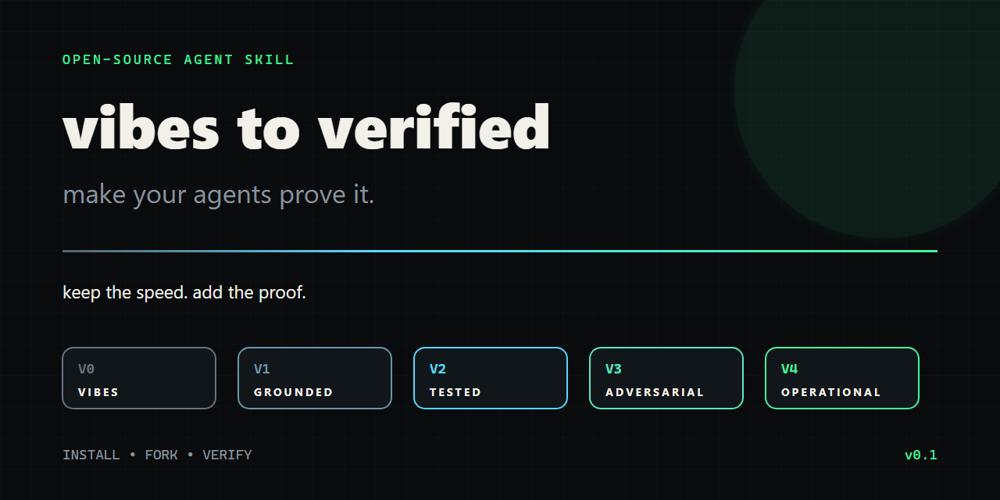
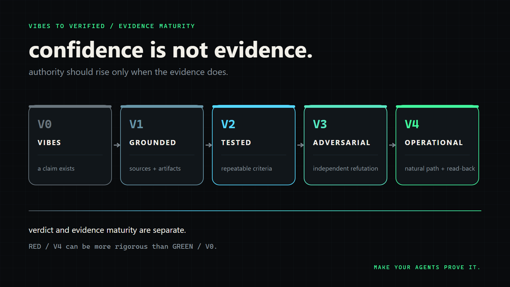

# Vibes to Verified



> **Make your agents prove it.**

Vibes to Verified is a portable Agent Skill for turning plausible AI output into scoped, falsifiable, independently challenged, operationally evidenced results.

```text
V0          V1           V2          V3             V4
VIBES  →  GROUNDED  →  TESTED  →  ADVERSARIAL  →  OPERATIONAL
```

**Vibe coding is not the problem. Stopping at vibes is.**

## Why

AI can produce useful software and analysis quickly. The failure begins when fluent output is granted more authority than its evidence supports.

Vibes to Verified separates:

- **Verdict:** `GREEN`, `YELLOW`, `RED`, `BLOCKED`, or `REJECTED`
- **Evidence maturity:** `V0` through `V4`

A confident answer can be `GREEN / V0`. A rigorously reproduced failure can be `RED / V4`.

## The V2V Scale

| Level | Name | What it means |
|---:|---|---|
| `V0` | Vibes | A claim exists. No traceable artifact supports it. |
| `V1` | Grounded | Primary sources, files, code paths, or raw evidence are attached. |
| `V2` | Tested | Controlled, repeatable tests pass explicit criteria. |
| `V3` | Adversarial | Independent refuters attack atomic claims against the final artifact. |
| `V4` | Operational | The artifact works through its natural real-world path with observable read-back within a named scope. |



## What the Skill Does

1. Bounds the task and authority.
2. Converts objectives into atomic falsifiable claims.
3. Preserves independent approach families.
4. Maintains an explicit approach registry.
5. Runs a dedicated refutation round.
6. Reproduces failures and requires regression evidence.
7. Separates verdict from evidence maturity.
8. Produces a machine-readable evidence card.
9. Provides disclosure-boundary guidance for excluding private implementation details from public case studies.

## 29-Second Visual Walkthrough

[Watch the narrated motion launch cut](media/exports/vibes-to-verified-launch-v4.mp4).

A separate [muted deterministic Manim overview](media/exports/vibes-to-verified-vertical.mp4), its source scene, and production plan are included under [`video/`](video/). The launch cut uses locally generated moving visual plates, authored typography, the creator's narration, and a music track the creator reports as cleared for this publication; the private rights receipt and production assets are not part of the public package. See [`media/RIGHTS.md`](media/RIGHTS.md).

## Quick Start

### Claude Code project skill

```bash
git clone {{REPOSITORY_URL}} .claude/skills/v2v
```

Claude Code discovers project skills from `.claude/skills/*/SKILL.md`.

### Hermes Agent user skill

```bash
git clone {{REPOSITORY_URL}} ~/.hermes/skills/v2v
```

Run `/reload-skills` after installation, or start a new Hermes session, so the skill index refreshes.

Invoke it directly with the short V2V command:

```text
/v2v verify this release candidate and return an evidence card
```

The package and public title remain **Vibes to Verified**; `v2v` is the
command-facing skill identifier.

### Other agents

Expose `SKILL.md` and its `references/`, `templates/`, and `schemas/` directories to the agent, then ask:

```text
Run Vibes to Verified on this claim and return an evidence card.
```

Clean-copy validation passed in both layouts. Hermes discovery and direct `/v2v` invocation were exercised once in the active Telegram gateway after `/reload-skills`; Claude Code live discovery and execution remain untested. This does not establish general runtime compatibility.

## Example Output

This fixture demonstrates the card structure. It deliberately remains `BLOCKED / V0` because no real artifact was inspected and no test was run.

```yaml
claim_id: C-01
claim: Two concurrent workers cannot both acquire authority for the same operation.
verdict: BLOCKED
v2v_level: V0
scope:
  environment: Illustrative documentation fixture; no execution occurred.
  artifact: fixture:concurrency-example
  observed_at: "2026-07-13T20:00:00Z"
acceptance_criteria:
  - Every exercised race produces exactly one authority winner.
rejection_criteria:
  - Any exercised race produces zero or multiple authority winners.
evidence: []
claim_dispositions: []
open_blockers:
  - No artifact was inspected and no test was run.
operational_proof: []
limitations:
  - No artifact was inspected and no test was run; this is structure only.
disclosure_boundary:
  public:
    - Synthetic claim and criteria
  private: []
next_action: Inspect a real final artifact and run the controlled race test.
```

The complete schema-valid fixture is [`examples/evidence-card-v0.yaml`](examples/evidence-card-v0.yaml).

Install validation dependencies, then validate an evidence card:

```bash
python -m pip install -r requirements-dev.txt
python scripts/validate.py templates/evidence-card.yaml
```

The validator enforces structural promotion prerequisites. It cannot establish that an artifact is truthful, that a test exercised the claimed boundary, or that a reviewer was genuinely independent; those remain substantive verification duties.

## Repository Map

```text
SKILL.md                         portable agent workflow
references/v2v-scale.md          evidence maturity specification
references/verdict-vs-evidence.md two-axis decision model
references/common-failure-modes.md verification anti-patterns
templates/evidence-card.yaml     copyable final report
templates/approach-registry.md   approach portfolio tracker
templates/refutation-round.md    independent challenge contract
schemas/evidence-card.schema.json machine-readable validation
examples/                        sanitized applications
article/                         complete X Article and launch assets
media/                           deterministic graphics and Manim export
.github/workflows/validate.yml   public CI verification gate
scripts/validate.py              local package validator
tests/                           contract tests
```

## A Real, Sanitized Case

The workflow was developed alongside an AI-built automated **options paper-trading risk-control system**. No live capital was involved.

Independent reviews found different classes of problems across successive final artifacts. The public example describes the verification process and broad failure classes while excluding trading strategy, account data, private source code, broker configuration, local infrastructure, and exploitable implementation details.

See [`examples/options-paper-trading-risk-control.md`](examples/options-paper-trading-risk-control.md).

## Design Principles

- Consensus is not proof.
- More agents do not guarantee more independent reasoning.
- Atomic claims are easier to break and repair.
- Tests establish `V2`, not automatically `V3` or `V4`.
- Refuters inspect the final artifact, not the builder's confidence.
- Natural operation matters more than a staged demonstration.
- `BLOCKED`, `RED`, and `REJECTED` are valid outcomes.
- Verification is always scoped.

## Status

`v0.1.0` is the initial public specification candidate. It must pass its own validation, privacy review, independent adversarial review, and final artifact check before release.

## Contributing

Real case studies, platform installation verification, counterexamples, evidence-schema improvements, and integrations are welcome. See [`CONTRIBUTING.md`](CONTRIBUTING.md).

## Attribution

The multi-agent search design was inspired in part by the OpenAI prompt linked in [`SOURCES.md`](SOURCES.md). Vibes to Verified is an independent reconstruction focused on portable agent verification, calibrated failure states, evidence maturity, and privacy-safe publication.

## License

Code, documentation, deterministic graphics, and the muted Manim overview are MIT licensed. Embedded narration and music in the rendered V4 launch video are excluded from that grant and are distributed only as part of the complete render under the creator's reported publication rights. See [`LICENSE`](LICENSE) and [`media/RIGHTS.md`](media/RIGHTS.md).
